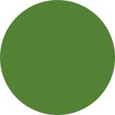

  
```{r message = F, warning = F, echo = F}
knitr::opts_chunk$set(echo = F, warning = F, message = F, fig.path = 'figures/')

library(tbeptools)
library(tidyverse)
library(lubridate)
library(plotly)
library(htmltools)
library(shiny)
library(mapview)
library(leaflet)
library(sf)
library(extrafont)
library(EnvStats)
library(leafsync)
library(forcats)
library(here)

source('R/funcs.R')

data(trnpts)
data(tbsegshed)
data(covest)
data(algdat)
data(allann)

prj <- 4326
st_crs(trnpts) <- prj
st_crs(tbsegshed) <- prj

loadfonts(device = 'pdf', quiet = T)
if(Sys.info()[1] == 'Windows')
  loadfonts(device = 'win', quiet = T)

fml <- 'Lato Light'

otbshed <- tbsegshed %>% 
  filter(bay_segment %in% 'OTB')
otbpts <- trnpts[otbshed, ]

wqstat <- stations %>% 
  filter(bay_segment %in% 'OTB')

epcdata <- epcdata %>% 
  filter(yr >= 1998) %>% 
  mutate(
    sd_q = case_when(
      is.na(sd_q) ~ T, 
      !is.na(sd_q) ~ F
    )
  )

# for factor levels
algnms <- c('Bacillariophyta', 'Cyanobacteria', 'Karenia brevis', 'Pseudo-nitzschia pungens', 'Pseudo-nitzschia sp.', 'Pyrodinium bahamense', 'Tripos hircus', 'other')
cols <- pal_alg(algnms)
names(cols) <- algnms
savnms <- c('AA', 'DA', 'Halodule', 'Thalassia', 'Syringodium', 'Ruppia', 'Halophila spp.')

# names for map comparison selection
names(algnms) <- algnms
wqalgnms <- c(list('Total nitrogen' = 'tn', 'Chorophyll-a' = 'chla', 'Secchi' = 'sd_raw_m', 'Salinity' = 'Sal_Mid_ppth', 'Temperature' = 'Temp_Water_Mid_degC'), as.list(algnms))

# minor theme tweaks
pthm <- theme(
    axis.text.x = element_text(size = 11, angle = 45, hjust = 1),
    legend.text = element_text(size = 12), 
    axis.title.y = element_text(size = 12),
    text = element_text(fml), 
    legend.position = 'top',
    # panel.grid.minor=element_blank(),
    # panel.grid.major=element_blank(),
    panel.background = element_rect(fill = '#ECECEC')
    ) 

# base map
m <- mapview(otbpts, homebutton = F, layer.name = 'Transects', col.regions = 'darkgreen') +
  mapview(st_as_sf(wqstat, coords = c('Longitude', 'Latitude'), crs = st_crs(tbshed)), homebutton = F, layer.name = 'EPCHC stations', col.regions = 'darkblue') 
m <- m@map
```

```{r reactives}
mapsel <- reactive({
  
  # input
  trn <- input$trn
  wqst <- input$wqst
  
  trnpt <- otbpts %>% 
    filter(TRAN_ID %in% trn)
  
  wqstpt <- wqstat %>% 
    filter(epchc_station %in% wqst)
  
  out <- m %>% 
    clearMarkers() %>% 
    addCircles(data = trnpt, ~LONG_DD, ~LAT_DD, color = 'darkgreen', weight = 20) %>% 
    addCircles(data = wqstpt, ~Longitude, ~Latitude, color = 'darkblue', weight = 20) %>% 
    addLabelOnlyMarkers(data = otbpts, ~LONG_DD, ~LAT_DD, label = ~TRAN_ID, labelOptions = labelOptions(
      noHide = T, 
      direction = 'auto', 
      textOnly = T,
      textsize = '15px',
      style = list(
        'color' = 'darkgreen'
      )
    )) %>% 
    addLabelOnlyMarkers(data = wqstat, ~Longitude, ~Latitude, label = ~epchc_station, labelOptions = labelOptions(
      noHide = T, 
      direction = 'auto', 
      textOnly = T,
      textsize = '15px',
      style = list(
        'color' = 'darkblue'
      )
    ))
  
  return(out)
  
})

# observed data plot
obsplo <- reactive({
  
  # input
  wqst <- input$wqst
  sgty <- input$sgty
  trn <- input$trn
  
  ##
  # data to plot
  
  # wq data
  wqplo <- epcdata %>% 
    filter(epchc_station %in% wqst) %>% 
    select(Date = SampleTime, sd_raw_m, sd_q, chla) %>% 
    mutate(Date = as.Date(Date))
  
  # algae data
  algplo <- algdat %>% 
    filter(epchc_station %in% wqst) %>% 
    group_by(yrqrt, name) %>%
    summarise(count = sum(count, na.rm = T)) %>% 
    ungroup %>% 
    mutate(
      name = factor(name, levels = algnms, labels = algnms)
      )

  # seagrass data
  sglab <- 'BB Abundance'
  sgval <- 'bbest'
  if(sgty == 'Freq. Occ.'){
    sglab <- 'Freq. Occ. (%)'
    sgval <- 'foest'
  }
  sgplo <- covest %>% 
    filter(Transect %in% trn) %>% 
    rename(val = !!sgval)
  
  ##
  # plots

  # chl plot
  p1 <- plot_ly(wqplo, x = ~Date, y = ~chla, name = 'Chlorophyll-a', type= 'scatter', mode = 'lines', line = list(color = '#427355')) %>% 
    layout(
      yaxis = list(title = 'Conc. (ug/L)'),
      xaxis = list(gridcolor = '#FFFFFF'),
      showlegend = T, 
      font = list(family = fml)
    )
  
  # secchi plot
  p2 <- plot_ly(wqplo, x = ~Date) %>% 
    add_trace(y = ~sd_raw_m, name = 'Secchi depth', type= 'scatter', mode = 'lines', line = list(color = '#0047FE')) %>% 
    layout(
      yaxis = list(title = 'Depth (m)'),
      xaxis = list(gridcolor = '#FFFFFF'),
      showlegend = T, 
      font = list(family = fml)
    )
  
  if(any(!wqplo$sd_q))
    p2 <- p2 %>% 
      add_trace(data = wqplo[!wqplo$sd_q, ], x = ~Date, y = ~sd_raw_m, name = 'Secchi on bottom', type = 'scatter', mode = 'marker', marker = list(color = "#FF6347", size = 8))
  
  # algae plot
  p3 <-  plot_ly(algplo, x = ~ yrqrt, y= ~count, color = ~name, text = ~paste0(name, ', ', yrqrt), hoverinfo = 'text') %>% 
    add_bars() %>% 
    layout(
      yaxis = list(title = 'Phyto. cell count (0.1/ml)', gridcolor = '#FFFFFF'),
      barmode = 'stack',
      showlegend = T, 
      font = list(family = fml)
    )

  # seagrass plot
  p4 <- plot_ly(sgplo, x = ~Date, y = ~val, color = ~Savspecies, stackgroup = 'one', type = 'scatter', mode = 'none') 
  if(sgty == 'Freq. Occ.')
      p4 <- plot_ly(sgplo, x = ~Date, y = ~val, color = ~Savspecies, stackgroup = 'one', type = 'scatter', mode = 'none', groupnorm = 'percent') 

  p4 <- p4 %>% 
    layout(
      yaxis = list(title = sglab),
      xaxis = list(title = NA, gridcolor = '#FFFFFF'),
      barmode = 'stack',
      showlegend = T, 
      legend = list(title = list(text = 'Seagrass')),
      shapes = vrtline_fun(sgplo, sgty)
    )

  out <- subplot(p3, p1, p2, p4, nrows = 4, shareX = T, titleY = T, which_layout = 1) %>%
    layout(
      # title = paste0('Station ', wqst, ', Transect ', trn),
      # legend = list(font = list(size = 16)), 
      yaxis = list(gridcolor = '#ECECEC'),
      font = list(family = fml),
      plot_bgcolor = '#FFFFFF'
    )
  
  return(out)
  
})

# trend estimates for selected years
trnds <- reactive({
  
  # input
  yrsl <- input$yrsl

  out <- allann %>% 
    filter(yr >= yrsl[1] & yr <= yrsl[2]) %>% 
    group_by(dat, station, var) %>% 
    nest %>% 
    mutate(
      trnd = purrr::map(data, function(data){
        
        knout <- try({kendallTrendTest(val ~ yr, data)})
                  
        if(inherits(knout, 'try-error') | nrow(data) < 2){
          out <- data.frame(n = NA, tau = NA, slope= NA, pval = NA)
          return(out)
        }
        
        outest <- round(knout$estimate, 2)
        outpval <- p_ast(knout$p.value)
        nval <- nrow(na.omit(data))
        out <- c(n = nval, outest, pval = outpval) %>%
          data.frame %>%
          t %>%
          data.frame %>%
          select(-intercept)
        return(out)
        
      })
    ) %>% 
    select(-data) %>% 
    unnest(trnd) %>% 
    na.omit() %>% 
    mutate(
      n = as.numeric(n),
      tau = as.numeric(tau), 
      slope = as.numeric(slope), 
      var = factor(var, levels = rev(c(unlist(wqalgnms), savnms)), labels = rev(c(names(wqalgnms), savnms)))
    )
  
  return(out)
  
})

# sg trend matrix
sgtrndplo <- reactive({
  
  # input
  trnds <- trnds()

  toplo <- trnds %>% 
    filter(dat %in% 'cov') %>% 
    mutate(var = fct_drop(var)) 

  p <- ggplot(toplo, aes(x = var, y = station, fill = tau)) + 
    geom_tile(colour = 'grey') +
    geom_text(aes(label = pval)) + 
    scale_x_discrete(expand = c(0, 0)) + 
    scale_y_discrete('Transect', expand = c(0, 0)) + 
    scale_fill_gradient2('Kendall tau', low = 'lightblue', mid = 'white', high = 'lightgreen', limits = c(-1, 1)) + 
    theme(
      axis.title.x = element_blank(),
      axis.text.x = element_text(angle = 30)
      )
  
  out <- ggplotly(p)

  return(out)
  
})

# wq trend matrix
wqtrndplo <- reactive({
  
  # input
  trnds <- trnds()

  toplo <- trnds %>% 
    filter(dat %in% 'epc') %>% 
    mutate(var = fct_drop(var))

  p <- ggplot(toplo, aes(x = var, y = station, fill = tau)) + 
    geom_tile(colour = 'grey') +
    geom_text(aes(label = pval)) + 
    scale_x_discrete(expand = c(0, 0)) + 
    scale_y_discrete('EPCHC station', expand = c(0, 0)) + 
    scale_fill_gradient2('Kendall tau', low = 'lightblue', mid = 'white', high = 'lightgreen', limits = c(-1, 1)) + 
    theme(
      axis.title.x = element_blank(),
      axis.text.x = element_text(angle = 30)
      )
  
  out <- ggplotly(p)

  return(out)
  
})

# phyto trend matrix
algtrndplo <- reactive({
  
  # input
  trnds <- trnds()

  toplo <- trnds %>% 
    filter(dat %in% 'alg') %>% 
    mutate(var = fct_drop(var))

  p <- ggplot(toplo, aes(x = var, y = station, fill = tau)) + 
    geom_tile(colour = 'grey') +
    geom_text(aes(label = pval)) + 
    scale_x_discrete(expand = c(0, 0)) + 
    scale_y_discrete('EPCHC station', expand = c(0, 0)) + 
    scale_fill_gradient2('Kendall tau', low = 'lightblue', mid = 'white', high = 'lightgreen', limits = c(-1, 1)) + 
    theme(
      axis.title.x = element_blank(), 
      panel.background = element_rect(color = 'white'), 
      axis.text.x = element_text(angle = 30)
      )
  
  out <- ggplotly(p)

  return(out)
  
})

# map trend selection
trndmapsel <- reactive({
  
  # input
  trnds <- trnds()
  sgvar1 <- input$sgvar1
  wqalgvar1 <- input$wqalgvar1
  sgvar2 <- input$sgvar2
  wqalgvar2 <- input$wqalgvar2

  trnds <- trnds %>% 
    mutate(
      sz = abs(tau), 
      sz = scales::rescale(sz, to= c(3, 15), from = c(0, 1)), 
      cols = ifelse(sign(tau) == -1, 'blue', 'green'), 
      pval = ifelse(pval == '', 'ns', pval)
      )
  sgtrnd1 <- trnds %>% 
    filter(var %in% sgvar1) %>% 
    rename(TRAN_ID = station) %>% 
    left_join(., otbpts, by = 'TRAN_ID')
  wqalgtrnd1 <- trnds %>% 
    filter(var %in% wqalgvar1) %>% 
    rename(epchc_station = station) %>% 
    mutate(epchc_station = as.numeric(epchc_station)) %>% 
    left_join(., wqstat, by = 'epchc_station')
  sgtrnd2 <- trnds %>% 
    filter(var %in% sgvar2) %>% 
    rename(TRAN_ID = station) %>% 
    left_join(., otbpts, by = 'TRAN_ID')
  wqalgtrnd2 <- trnds %>% 
    filter(var %in% wqalgvar2) %>% 
    rename(epchc_station = station) %>% 
    mutate(epchc_station = as.numeric(epchc_station)) %>% 
    left_join(., wqstat, by = 'epchc_station')

  m1 <- m %>% 
    clearMarkers() %>% 
    clearControls() %>% 
    addMarkers(data = sgtrnd1[sgtrnd1$cols == 'green', ], ~LONG_DD, ~LAT_DD, icon = makeIcon(here('www/upsg.png'), 15, 15), label = ~paste0('Transect: ', TRAN_ID, ', Tau: ', tau, ', p ', pval)) %>% 
    addMarkers(data = sgtrnd1[sgtrnd1$cols == 'blue', ], ~LONG_DD, ~LAT_DD, icon = makeIcon(here('www/dnsg.png'), 15, 15), label = ~paste0('Transect: ', TRAN_ID, ', Tau: ', tau, ', p ', pval)) %>% 
    addMarkers(data = sgtrnd1[sgtrnd1$pval != 'ns', ], ~LONG_DD, ~LAT_DD, icon = makeIcon(here('www/sigsg.png'), 15, 15), label = ~paste0('Transect: ', TRAN_ID, ', Tau: ', tau, ', p ', pval)) %>% 
    addMarkers(data = wqalgtrnd1[wqalgtrnd1$cols == 'green', ], ~Longitude, ~Latitude, icon = makeIcon(here('www/upwq.png'), 15, 15), label = ~paste0('Station: ', epchc_station, ', Tau: ', tau, ', p ', pval)) %>% 
    addMarkers(data = wqalgtrnd1[wqalgtrnd1$cols == 'blue', ], ~Longitude, ~Latitude, icon = makeIcon(here('www/dnwq.png'), 15, 15), label = ~paste0('Station: ', epchc_station, ', Tau: ', tau, ', p ', pval)) %>% 
    addMarkers(data = wqalgtrnd1[wqalgtrnd1$pval != 'ns', ], ~Longitude, ~Latitude, icon = makeIcon(here('www/sigwq.png'), 15, 15), label = ~paste0('Station: ', epchc_station, ', Tau: ', tau, ', p ', pval))
  
  
  m2 <- m %>% 
    clearMarkers() %>% 
    clearControls() %>% 
    addMarkers(data = sgtrnd2[sgtrnd2$cols == 'green', ], ~LONG_DD, ~LAT_DD, icon = makeIcon(here('www/upsg.png'), 15, 15), label = ~paste0('Transect: ', TRAN_ID, ', Tau: ', tau, ', p ', pval)) %>% 
    addMarkers(data = sgtrnd2[sgtrnd2$cols == 'blue', ], ~LONG_DD, ~LAT_DD, icon = makeIcon(here('www/dnsg.png'), 15, 15), label = ~paste0('Transect: ', TRAN_ID, ', Tau: ', tau, ', p ', pval)) %>% 
    addMarkers(data = sgtrnd2[sgtrnd2$pval != 'ns', ], ~LONG_DD, ~LAT_DD, icon = makeIcon(here('www/sigsg.png'), 15, 15), label = ~paste0('Transect: ', TRAN_ID, ', Tau: ', tau, ', p ', pval)) %>% 
    addMarkers(data = wqalgtrnd2[wqalgtrnd2$cols == 'green', ], ~Longitude, ~Latitude, icon = makeIcon(here('www/upwq.png'), 15, 15), label = ~paste0('Station: ', epchc_station, ', Tau: ', tau, ', p ', pval)) %>% 
    addMarkers(data = wqalgtrnd2[wqalgtrnd2$cols == 'blue', ], ~Longitude, ~Latitude, icon = makeIcon(here('www/dnwq.png'), 15, 15), label = ~paste0('Station: ', epchc_station, ', Tau: ', tau, ', p ', pval)) %>% 
    addMarkers(data = wqalgtrnd2[wqalgtrnd2$pval != 'ns', ], ~Longitude, ~Latitude, icon = makeIcon(here('www/sigwq.png'), 15, 15), label = ~paste0('Station: ', epchc_station, ', Tau: ', tau, ', p ', pval))
  
  
  out <- m1 #leafsync::sync(m1, m2, ncol = 2)
  
  return(out)
  
})

# multiple comp 1 selection, not aggregated
mltcmp1 <- reactive({
  
  # input
  wqst2 <- input$wqst2
  trn2 <- input$trn2
  yrsl <- input$yrsl

  out <- allann %>% 
    filter(yr >= yrsl[1] & yr <= yrsl[2]) %>% 
    filter(station %in% c(wqst2, trn2)) %>% 
    group_by(var, yr, dat) %>% 
    nest %>% 
    mutate(
      data = purrr::map(data, function(x){
        
        ave <- try({mean(x$val, na.rm = TRUE)})
        brs <- try({t.test(x$val)$conf.int %>% diff() / 2})
        
        if(inherits(ave, 'try-error'))
          ave <- NA
          
        if(inherits(brs, 'try-error'))
          brs <- NA
        
        sumout <- data.frame(ave = ave, brs = brs)
        
        return(sumout)
        
      })
    ) %>% 
    unnest('data') %>% 
    ungroup() %>% 
    mutate(
      var = factor(var, levels = rev(c(unlist(wqalgnms), savnms)), labels = rev(c(names(wqalgnms), savnms)))
    )
  
  return(out)
  
})

# multiple comp plot 1
mltcmpplo1 <- reactive({
  
  # input
  mltcmp1 <- mltcmp1()

  tocmb <- levels(mltcmp1$var)
  trnds <- crossing(cmb1 = tocmb, cmb2 = tocmb) %>% 
    filter(cmb1 != cmb2) %>% 
    group_by(cmb1, cmb2) %>% 
    nest() %>% 
    mutate(
      data = purrr::pmap(list(cmb1, cmb2), function(cmb1, cmb2){
        
        totrnd <- mltcmp1 %>% 
          filter(var %in% c(cmb1, cmb2)) %>% 
          select(yr, var, ave) %>% 
          spread(var, ave) 
        
        trnd <- try({cor.test(totrnd[[cmb1]], totrnd[[cmb2]], method = 'spearman')})

        if(inherits(trnd, 'try-error')){
          out <- data.frame(corv = NA, pval = NA)
          return(out)
        }

        outest <- round(trnd$estimate, 2)
        outpval <- p_ast(trnd$p.value)
        out <- data.frame(corv = outest, pval = outpval)
        
        return(out)
        
      })
    ) %>% 
    unnest(data) %>%
    na.omit() %>%
    mutate(
      corv = as.numeric(corv), 
      cmb1 = factor(cmb1, levels = tocmb), 
      cmb2 = factor(cmb2, levels = tocmb)
    ) 
  
  toplo <- trnds
  
  # plot
  p <- ggplot(toplo, aes(x = cmb1, y = cmb2, fill = corv)) + 
    geom_tile(colour = 'grey') +
    geom_text(aes(label = pval)) + 
    scale_x_discrete(expand = c(0, 0)) + 
    scale_y_discrete('EPCHC station', expand = c(0, 0)) + 
    scale_fill_gradient2('Spearman rho', low = 'lightblue', mid = 'white', high = 'lightgreen', midpoint = 0, limits = c(-1, 1)) + 
    theme(
      axis.title = element_blank(), 
      panel.background = element_rect(color = 'white'), 
      axis.text.x = element_text(angle = 30)
      )
  
  out <- ggplotly(p)

  return(out)
  
})

# multiple plot comp 2
mltcmpplo2 <- reactive({
  
  # input
  wqvar3 <- input$wqvar3
  algvar3 <- input$algvar3
  sgvar3 <- input$sgvar3
  yrsl <- input$yrsl
  mltcmp1 <- mltcmp1()

  toplo <- mltcmp1 %>% 
    filter(var %in% c(wqvar3, algvar3, sgvar3)) %>% 
    gather('sum', 'val', ave, brs) %>% 
    unite('varsum', dat, sum, sep = '_') %>% 
    select(-var) %>%
    spread(varsum, val)

  # plots
  yrsl[1] <- yrsl[1] - 1
  yrsl[2] <- yrsl[2] + 1
  mrk <- list(size = 8, opacity = 1, color = 'black', showlegend = F)

  p1 <- plot_ly(toplo[!is.na(toplo$epc_ave), ], x = ~yr, y = ~epc_ave, mode = 'markers', type = 'scatter', error_y = list(array = ~epc_brs, width = 0), color = I('lightblue')) %>%  
    add_trace(mode = 'markers', marker = mrk, showlegend = F) %>% 
    layout(
      yaxis = list(title = wqvar3),
      xaxis = list(title = 'Year', gridcolor = '#FFFFFF', range = yrsl)
      )
  p2 <- plot_ly(toplo[!is.na(toplo$alg_ave), ], x = ~yr, y = ~alg_ave, mode = 'markers', type = 'scatter', error_y = list(array = ~alg_brs, width = 0), color = I('orange')) %>%  
    add_trace(mode = 'markers', marker = mrk, showlegend = F) %>% 
    layout(
      yaxis = list(title = algvar3),
      xaxis = list(title = 'Year', gridcolor = '#FFFFFF', range = yrsl)
    )
  p3 <- plot_ly(toplo[!is.na(toplo$cov_ave), ], x = ~yr, y = ~cov_ave, mode = 'markers', type = 'scatter', error_y = list(array = ~cov_brs, width = 0), color = I('lightgreen')) %>%
    add_trace(mode = 'markers', marker = mrk, showlegend = F) %>% 
    layout(
      yaxis = list(title = sgvar3),
      xaxis = list(title = 'Year', gridcolor = '#FFFFFF', range = yrsl)
    )

  out <- subplot(p1, p2, p3, nrows = 1, shareX = T, titleY = T, margin = 0.04) %>% 
    layout(
      showlegend = F, 
      xaxis = list(title = 'Year')
      )
  
  return(out)
  
})

# multiple plot comp 3
mltcmpplo3 <- reactive({
  
  # input
  wqvar3 <- input$wqvar3
  algvar3 <- input$algvar3
  sgvar3 <- input$sgvar3
  mltcmp1 <- mltcmp1()
  
  toplo <- mltcmp1 %>% 
    filter(var %in% c(wqvar3, algvar3, sgvar3)) %>% 
    mutate(
      var = factor(var, levels = c(wqvar3, algvar3, sgvar3), labels = c('wq', 'alg', 'sg')), 
      var = as.character(var)
    ) %>% 
    gather('sum', 'val', ave, brs) %>% 
    unite('varsum', var, sum, sep = '_') %>% 
    select(-dat) %>% 
    spread(varsum, val)
  
  # max values
  mxv <- toplo %>% 
    mutate(
      algmx = alg_ave + alg_brs,
      sgmx = sg_ave + sg_brs,
      wqmx = wq_ave + wq_brs
    ) %>% 
    gather('var', 'val', algmx, sgmx, wqmx) %>% 
    group_by(var) %>% 
    summarise(val = max(val)) %>%  
    spread(var, val)
  
  # plots
  mrk <- list(size = 8, opacity = 1, color = 'black', showlegend = F)

  p1 <- plot_ly(toplo[!is.na(toplo$wq_ave)&!is.na(toplo$alg_ave), ], type = 'scatter', mode = 'markers') %>%
    add_trace(x = ~wq_ave, y = ~alg_ave, error_x = list(array = ~wq_brs, width = 0), name = 'Water quality', color = I('lightblue')) %>% 
    add_trace(x = ~wq_ave, y = ~alg_ave, error_y = list(array = ~alg_brs, width = 0), name = 'Phytoplankton', color = I('orange')) %>%  
    add_trace(x = ~wq_ave, y = ~alg_ave, marker = mrk, showlegend = F) %>% 
    layout(
      xaxis = list(title = wqvar3, gridcolor = '#FFFFFF'),# range = c(0, mxv[['wqmx']])),
      yaxis = list(title = algvar3)#, range = c(0, mxv[['algmx']]))
      )
  p2 <- plot_ly(toplo[!is.na(toplo$sg_ave)&!is.na(toplo$alg_ave), ], type = 'scatter', mode = 'markers') %>%
    add_trace(x = ~alg_ave, y = ~sg_ave, error_x = list(array = ~alg_brs, width = 0), name = 'Pytoplankton', color = I('orange'), showlegend = F) %>% 
    add_trace(x = ~alg_ave, y = ~sg_ave, error_y = list(array = ~sg_brs, width = 0), name = 'Seagrass coverage', color = I('lightgreen')) %>%  
    add_trace(x = ~alg_ave, y = ~sg_ave, marker = mrk, showlegend = F) %>% 
    layout(
      xaxis = list(title = algvar3, gridcolor = '#FFFFFF'),# range = c(0, mxv[['algmx']])),
      yaxis = list(title = sgvar3)#, range = c(0, mxv[['sgmx']]))
      )
  p3 <- plot_ly(toplo[!is.na(toplo$wq_ave)&!is.na(toplo$sg_ave), ], type = 'scatter', mode = 'markers') %>%
    add_trace(x = ~sg_ave, y = ~wq_ave, error_x = list(array = ~sg_brs, width = 0), name = 'Seagrass coverage', color = I('lightgreen'), showlegend = F) %>% 
    add_trace(x = ~sg_ave, y = ~wq_ave, error_y = list(array = ~wq_brs, width = 0), name = 'Water quality', color = I('lightblue'), showlegend = F) %>%  
    add_trace(x = ~sg_ave, y = ~wq_ave, marker = mrk, showlegend = F) %>% 
    layout(
      xaxis = list(title = sgvar3, gridcolor = '#FFFFFF'),#, range = c(0, mxv[['sgmx']])),
      yaxis = list(title = wqvar3)#, range = c(0, mxv[['wqmx']]))
      )
  out <- subplot(p1, p2, p3, nrows = 1, titleX = T, titleY = T, margin = 0.04) %>%  
    layout(
      legend = list(orientation = "h",   # show entries horizontally
                     xanchor = "center",  # use center of legend as anchor
                     x = 0.5, y = -0.3)
    )

  return(out)
  
})

```

# Old Tampa Bay Seagrass evaluation {.tabset}

## Observed changes

```{r, out.width = '100%'}
output$mapsel <- renderLeaflet(mapsel())
leafletOutput('mapsel')
```

```{r}
column(12,
  column(4, selectInput('wqst', 'Select water quality station:', choices = sort(unique(wqstat$epchc_station)))), 
  column(4, selectInput('trn', 'Select transect:', choices = levels(covest$Transect))),
  column(4, selectInput('sgty', 'Select seagrass plot type:', choices = c('BB average', 'Freq. Occ.')))
)
```

<br>
<br>
<br>

```{r}
output$obsplo <- renderPlotly(obsplo())
plotlyOutput('obsplo', height = "1000px")
```

## Trends and correlations {.tabset .tabset-pills}

All analyses based on annual averages. 

```{r}
column(12, 
  column(6, sliderInput('yrsl', 'Select date range:', min = 1998, max = 2019, value = c(1998, 2019), sep = '', width = 600))
)
```

<br>
<br>
<br>

### Water quality

```{r}
output$wqtrndplo <- renderPlotly(wqtrndplo())
plotlyOutput('wqtrndplo', height = 600, width = 600)
```

### Phytoplankton

```{r}
output$algtrndplo <- renderPlotly(algtrndplo())
plotlyOutput('algtrndplo', height = 600, width = 600)
```

### Seagrass abundance

```{r}
output$sgtrndplo <- renderPlotly(sgtrndplo())
plotlyOutput('sgtrndplo', height = 600, width = 600)
```

### Maps

```{r}
output$trndmapsel <- renderUI(trndmapsel())
fillCol(
  flex = c(NA, NA, 1),
  column(12,
    column(6, 
      selectInput('sgvar1', 'Select seagrass map 1:', choices = savnms), 
      selectInput('wqalgvar1', 'Select water quality/phyto map 1:', choices = names(wqalgnms))
    ), 
    column(6, 
      selectInput('sgvar2', 'Select seagrass map 2:', choices = savnms, selected = 'Halodule'), 
      selectInput('wqalgvar2', 'Select water quality/phyto map 2:', choices = names(wqalgnms), selected = 'Chlorophyll-a')
    ),
  ),
  HTML('<center> Seagrass sig. trend &nbsp; Seagrass increase &nbsp; Seagrass decrease </center> <br> <center> Water quality/phyto sig. trend &nbsp; Water quality/phyto increase &nbsp; Water quality/phyto decrease</center><br>'),
  uiOutput('trndmapsel')
)
```

### Multiple comparisons {.tabset .tabset-pills}

```{r}
column(12,   
  column(6, selectInput('wqst2', 'Select water quality station:', choices = sort(unique(wqstat$epchc_station)), selected = sort(unique(wqstat$epchc_station)), multiple = T)), 
  column(6, selectInput('trn2', 'Select transect:', choices = levels(covest$Transect), selected = levels(covest$Transect), multiple = T)),
)
```

#### All correlations

```{r}
output$mltcmpplo1 <- renderPlotly(mltcmpplo1())
plotlyOutput('mltcmpplo1', height = "700px", width = "900px") 
```

#### Selected variables

```{r}
output$mltcmpplo2 <- renderPlotly(mltcmpplo2())
output$mltcmpplo3 <- renderPlotly(mltcmpplo3())
fillCol(
  flex = c(NA, NA, NA),
  column(12,
    column(4, selectInput('wqvar3', 'Select water quality:', choices = names(wqalgnms)[!names(wqalgnms) %in% algnms])),
    column(4, selectInput('algvar3', 'Select phyto:', choices = algnms)),
    column(4, selectInput('sgvar3', 'Select seagrass:', choices = savnms))
    ), 
  plotlyOutput('mltcmpplo2', width = "900px", height = '300px'),
  plotlyOutput('mltcmpplo3', width = "900px", height = '350px')
)
```

