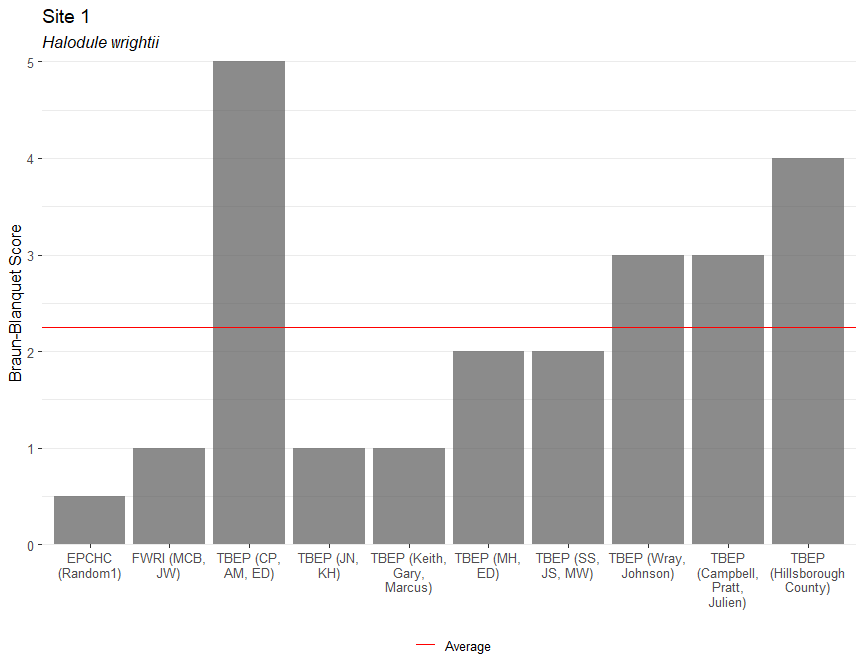

# README

[](https://travis-ci.org/tbep-tech/seagrasstransect)
[](https://ci.appveyor.com/project/tbep-tech/seagrasstransect)
[](https://codecov.io/gh/tbep-tech/seagrasstransect?branch=master)

This repository contains materials for importing annual seagrass
training data, summarizing results, and producing comparisons. View the
results [here](http://shiny.tbeptech.org/seagrasstransect/).

# Using the package

Install the package from GitHub using devtools.

``` r
install.packages('devtools')
devtools::install_github('tbep-tech/seagrasstransect')
library(seagrasstransct)
```

Use the functions to import data from the API and create a summary plot.

``` r
# import JSON
trndat <- read_trnjsn()

# format JSON data for plotting
trndat <- form_trnjsn(trndat)

# plot
show_compplot(trndat, site = '1', species = 'Halodule', varplo = 'Abundance', 
              base_size = 12)
```

<!-- -->
